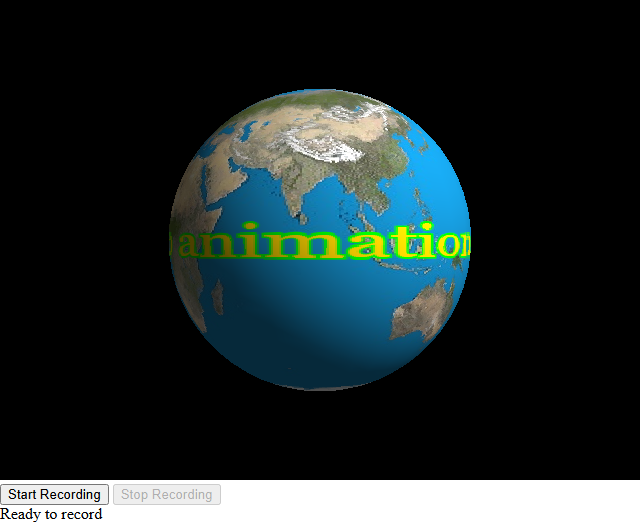

# Streaming WebGL animations

This repo is intended to become a guide on streaming audio and video data with Mozilla's 
[Media Capture and Streams API (Media Stream)](https://developer.mozilla.org/en-US/docs/Web/API/Media_Capture_and_Streams_API).

To introduce the technology, let us start with the sample demonstrating a closely affiliated 
[MediaStream Recording API](https://developer.mozilla.org/en-US/docs/Web/API/MediaStream_Recording_API). Media recording 
is a useful tool per se; as an education subject, it benefits from relative simplicity of implementation. From this POV, 
the sample can be considered a sort of visual aid for learners of media technologies.

The media recording part follows the guides that you can find in the **Media Capture and Streams API** section of MDN 
website. To make the exercise somewhat sophisticated, I include a number of features into implementation of the 
animation. Basically, it follows the [WebGL Tutorial](https://developer.mozilla.org/en-US/docs/Web/API/WebGL_API/Tutorial). 
I switched to the 3D model of sphere instead of the cube used in the tutorial. The sphere model is not that simple as 
the cube is; I borrowed positions, indices, and normals buffers from 
[coursera's Assignment 5](https://flyingdisc.github.io/InteractiveWebGL/webgl-texture.html) teaching aid.

To generate pixels of rendered text for a WebGL texture, I used an offscreen canvas trick (see text-renderer.js). 
The background image is generated from a base64 encoded image data URL; the DataURL const is defined in 
textureBackgroundImage.js and the image is loaded within arrow function of the window.onload event listener. 
The base64-encoded data of this DataURL const is generated from the image Earth512x512.jpeg included with this 
repo. To generate the image background dataURL from another image, use the utility **imageDataURLtool** which you
can built with the CMake project included with this repo (the folder 'imageDataURLtool'). To produce the expected 
effect in your animation, the image size should be 512x512. You can size your original image with an image editor or 
you can add the image sizing feature to the textureBackgroundImage project or add the feature of texture image tiling in 
webgl-demo.js -- anyway, this is a teaching aid project.

Unlike the WebGL tutorial samples, the application built in this repo can be launched by simply opening index.html in 
your browser from the filesystem -- for example, double-clicking this file. It is not that I am going to get rid of 
the http server at all cost: 
[file:/// URL origin is *opaque*](https://developer.mozilla.org/en-US/docs/Web/Security/Defenses/Same-origin_policy#file_origins), 
and you may trigger CORS errors when, for example, loading texture from image file resources. There exist scenarious where
use of the dataURL workaround is impractical. You cannot use javascript modules when working with opaque origin. But there 
are bonuses of working with file:/// data scheme -- some components can be developed without running an http server.

  
[click to view demo](https://vasilich-tregub.github.io)